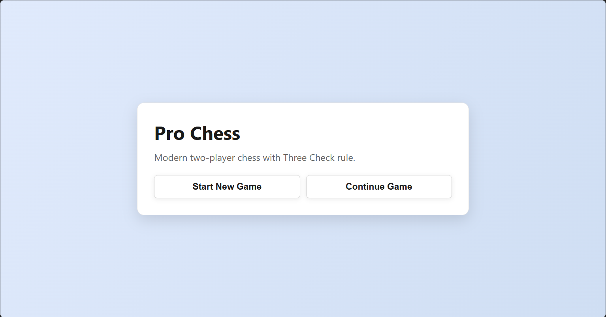
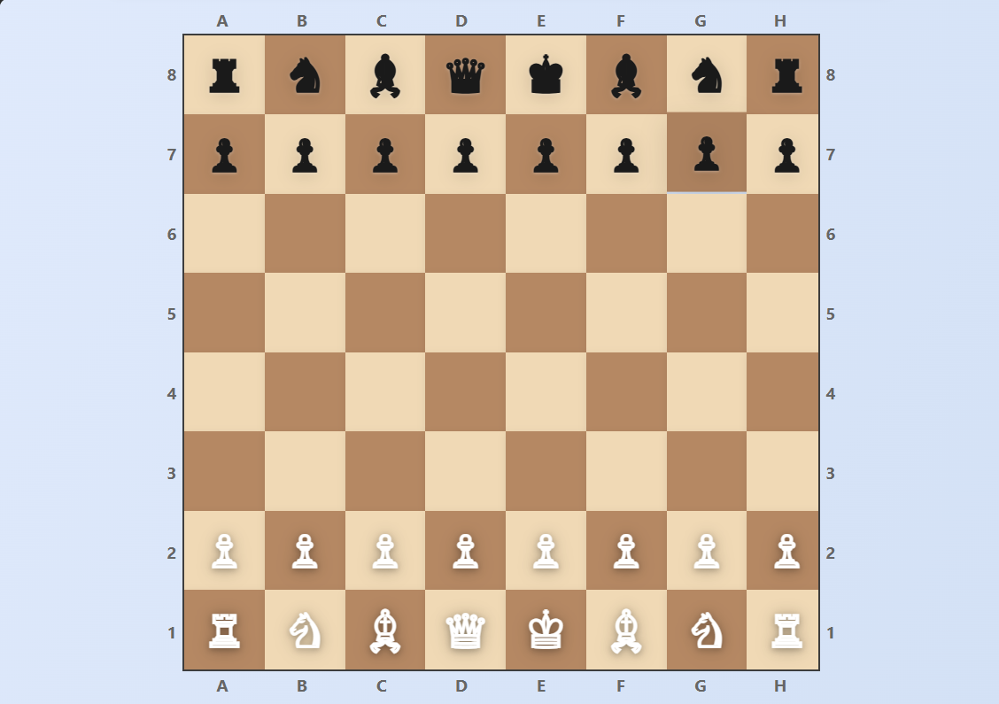
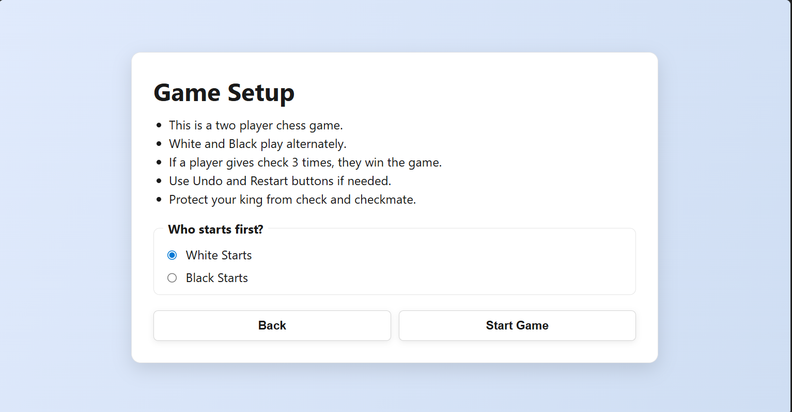
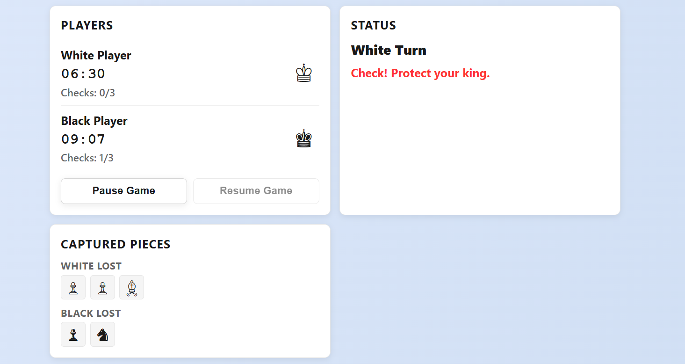
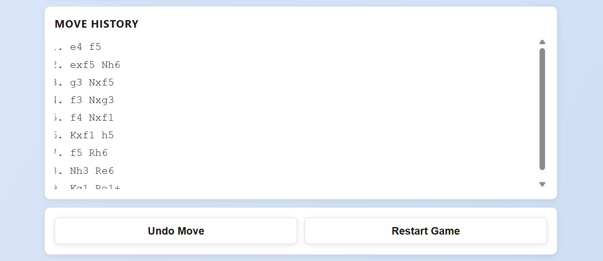

# Pro Chess


A modern two-player chess web application with Three Check rule support, local gameplay, timers, move history, and captured pieces tracking.

## GitHub About Text

Pro Chess is a responsive two-player chess web app with Three Check rule support, move history, timers, captured pieces tracking, and smooth local gameplay.

Suggested topics:

- chess
- chess-game
- javascript
- web-app
- capacitor
- android
- responsive-ui
- game-development

## Quick Start

Install dependencies:

```powershell
npm.cmd install
```

Run in browser:

```powershell
npx.cmd --yes http-server . -p 5173
```

Open:

- http://127.0.0.1:5173

## Features

- Local two-player chess match
- Three Check win condition
- Move history panel
- Captured pieces tracking
- Undo and restart controls
- Responsive board layout with rank/file coordinates

## Demo GIF

Add a GIF file at `assets/screenshots/demo.gif` to show a quick game flow in the README.


## Screenshots

Add browser screenshots inside `assets/screenshots/` with these file names:

- `browser-home-page.png`
- `browser-board-page.png`
- `browser-instructions-page.png`
- `browser-timer-panel.png`
- `browser-move-history.png`

Once added, GitHub will render them here:

### First Page



### Board Page



### Instructions Page



### Timer Panel



### Move History Panel



## Project Structure

- `index.html`, `style.css`, `script.js`: Main web app source
- `www/`: Synced web assets used by Capacitor
- `android/`: Capacitor Android project
- `assets/screenshots/`: README preview images

## Run Android (Capacitor)

```powershell
npx.cmd cap run android
```

## Notes

- If you update web files (`index.html`, `style.css`, `script.js`), keep `www/` files in sync for Capacitor builds.
- This repository is configured to ignore build outputs and dependencies with `.gitignore`.
